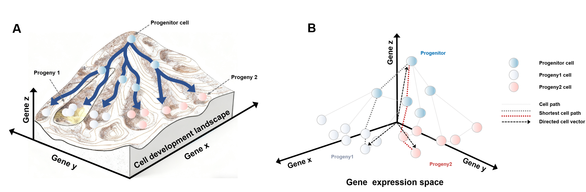
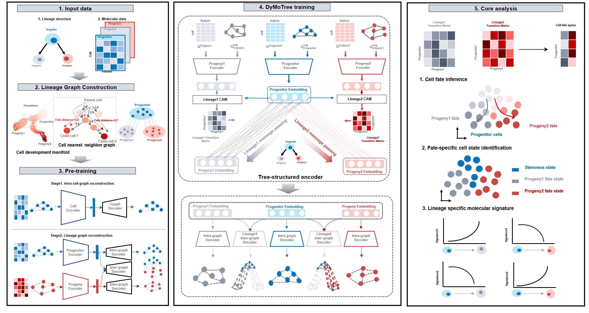

# DyMoTree: Dynamic Cell Fate Modeling Based on Tree-Structured Neural Network

DyMoTree is a integrated computaional framework for modeling dynamic cell fate transitions by integrating lineage tree structures with single-cell transcriptomic data. It enables robust inference of cell fate bias, identification of fate-specific states, and discovery of underlying molecular mechanisms.

---

## 1. Lineage graph construction

**Description**:  
This graph represents the conceptual landscape of cell differentiation, inspired by Waddington’s epigenetic landscape. It illustrates how progenitor cells evolve into distinct terminal cell types through branching developmental trajectories.

---

## 2. DyMoTree Framework

---

## 3. Usage

**Description**
how to use

---
